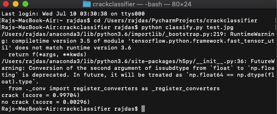

# Crack Detection  
Built on python, this repository contains the code for crack detection in concrete surfaces. 
A generic image classification program that uses Google's Machine Learning library, [Tensorflow](https://www.tensorflow.org/) and a pre-trained Deep Learning Convolutional Neural Network model called [Inception](https://research.googleblog.com/2016/03/train-your-own-image-classifier-with.html).

This model has been pre-trained for the [ImageNet](http://image-net.org/) Large Visual Recognition Challenge using the data from 2012, and it can differentiate between 1,000 different classes, like Dalmatian, dishwasher etc.
The program applies Transfer Learning to this existing model and re-trains it to classify a new set of images.

Here in this project, it has been retrained to differentiate between cracked and non-cracked surfaces.

## Dependencies
Make sure you have [Python](https://www.python.org/) installed, 
then install [Tensorflow](https://www.tensorflow.org/install/) on your system, and clone this repo.
'pip install tensorflow==1.4'


## Usage

### A folder named dataset has already been created which contains two sub-folders namely 'Crack' and 'No Crack'. Download the dataset from this [link](https://drive.google.com/drive/folders/102R9iOaT8zePRMMS3vhbSKkMH8tbOmrc?usp=sharing)
This enables classification of images between the  data sets.


### Initiate transfer learning
Go to the project directory and run:

```
$ bash run.sh  
```

This script installs the ``Inception`` model and initiates the re-training process for the specified image data sets.

Once the process is complete, it will return a training accuracy somewhere between ``85% - 100%``.

The ``training summaries``, ``trained graphs`` and ``trained labels`` will be saved in a folder named ``logs``.

### Classify objects

```
python classify.py test.jpg
```

Where ``test.jpg`` is the input file which is to be classified.

The classifier will output the predictions for each data set. A prediction score between ``0.8`` to ``1`` is considered to be optimal.

# Sample Output:



